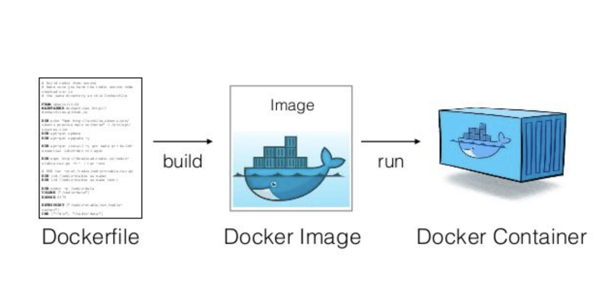

# Lab > Dockerizing applications

> Using Docker to contain the application's code, and all the necessary files to run on a server, locally, or in a
> Kubernettes swarm.

## Why [Docker](https://docs.docker.com)?

We used to have virtual machines that encapsulated our applications and logic, and at the height of the virtual machines
sometimes we almost had a virtual machine for every task it seemed. When the virtual machines started to become
cumbersome and bloated, containers were conceptualized with the philosophy of containing all the relevant pieces to run
on top of a specialized bare metal system; meaning when the shared pieces of the virtual machines were abstracted away
into Docker; the containers would run inside these specialized virtual machines. In essence the containers a
something like a highly specialized `.zip`.


### Containers, and [The Registry](https://hub.docker.com)

Containers themselves are not useful without using the specialized `.zip` file masquerading as a container. Success is
had with a container when it runs on your machine. When the container runs on your machine and you're ready to publish
it out to the world; there is a public and various private registries that allow sharing the containers across the
ecosystem. The registry provides a catalog of containers with their relevant configuration.

#### Building containers from containers


Another feature of containers is the ability to start from an existing ecosystem like `node`, `python`, `golang`, etc.
and leverage the existing containers as a starting point or to create a custom one that for what you need it for. When
containers stack upon each other they take with them the `good` and `bad` parts of the container. In Docker's infancy,
the containers were pretty large--to alleviate some of the container bloat pressures there were containers like the
`alpine:node` which specializes in only having the relevant pieces needed to run the application.

> This is an example of the container stacks that derive from building various containers on top of each other.


### Dockerfile(s)

Here is a brief [sample](examples/nextjs-app/Dockerfile) of a Dockerfile that will build a container that will run a
simple node application.



```dockerfile
FROM node:latest

WORKDIR /app

COPY . .

RUN npm install

RUN npm run build

CMD ["npm", "start"]
```

### Building the container

```bash
docker build --tag dockerized-app .
```

### Running Containers

Here is the [documentation](https://docs.docker.com/language/nodejs/run-containers/) on running a node like application.

```bash
docker run --publish 3000:3000 dockerized-app
```

#### Running in detached mode

This is great so far, but our sample application is a web server and we should not have to have our terminal connected
to the container. Docker can run your container in detached mode or in the background. To do this, we can use
the `--detach` or `-d` for short. Docker will start your container the same as before but this time will “detach” from
the container and return you to the terminal prompt.

```bash
docker run --detach --publish 3000:3000 dockerized-app
```

### docker `pull/push`

Like `git` docker has commands that mimic git's `push/pull` philosophy. Docker can leverage the similar concepts and the
parrallel is the same as `git`'s, you pull down changes. When you've changed the container, and it's code--you'
ll `docker build`, and `docker push` out the containers to the relevant registries.